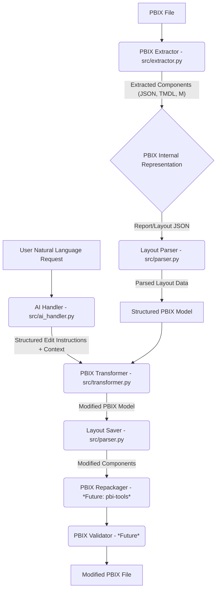
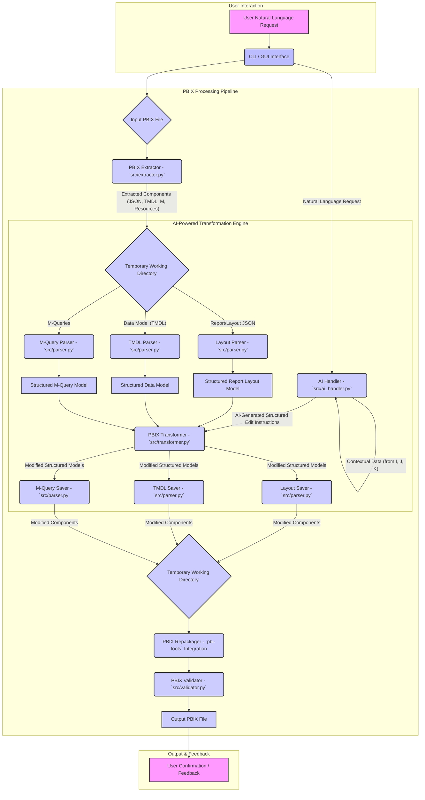

# 🚀 AI-Powered PBIX Transformer: Automating Power BI Development with LLMs

[](https://opensource.org/licenses/MIT)
[](CONTRIBUTING.md)
[](https://github.com/dynamo14324/ai-pbix-transformer/stargazers)
[](https://github.com/dynamo14324/ai-pbix-transformer/network/members)
[](https://github.com/dynamo14324/ai-pbix-transformer/issues)
[](https://github.com/dynamo14324/ai-pbix-transformer/pulls)

## 💡 Project Overview: Bridging AI and Business Intelligence

In the rapidly evolving landscape of data analytics, Power BI stands as a cornerstone for business intelligence. However, the manual manipulation of Power BI Desktop files (`.pbix`) can be a tedious, error-prone, and time-consuming process, especially for complex reports. The **AI-Powered PBIX File Transformer** project emerges as a groundbreaking solution to this challenge, leveraging the power of Artificial Intelligence to automate and streamline the analysis, modification, and repackaging of PBIX files.

This innovative system is designed to act as an intelligent intermediary, allowing users to interact with their Power BI reports using natural language. Imagine instructing an AI to "add a new sales trend chart to the dashboard" or "update the data source credentials across all reports" – this project aims to make such interactions a reality. By deconstructing PBIX files into their fundamental components, applying AI-driven transformations, and then meticulously reassembling them, we unlock unprecedented levels of efficiency and flexibility in Power BI development.

### The Challenge: Manual PBIX Manipulation

Power BI PBIX files are essentially sophisticated archives containing a myriad of elements: data models (expressed in Tabular Model Definition Language - TMDL), intricate report layouts (defined in JSON), data source queries (written in M scripts), and various static resources. Manually navigating and editing these components requires deep technical expertise and is highly susceptible to human error. Even a minor change can inadvertently corrupt the entire file, leading to significant rework and delays.

### Our Solution: AI-Driven Automation

Our project addresses these pain points by introducing an intelligent, automated workflow. Inspired by how AI tools effortlessly handle complex operations on Office files, the AI-Powered PBIX File Transformer provides a programmatic approach to PBIX manipulation. The core process involves several meticulously designed stages:

1.  **Extraction:** Deconstructing the PBIX file into its constituent parts, making them accessible for programmatic interaction.
2.  **Parsing:** Intelligently interpreting the structure and content of critical components, such as the report layout JSON and M-query scripts.
3.  **AI Interpretation:** Utilizing advanced Large Language Models (LLMs) to comprehend natural language instructions from users and translate them into precise, structured edit commands.
4.  **Transformation:** Programmatically applying the AI-generated instructions to modify the extracted PBIX components.
5.  **Repackaging:** Recompiling the modified components back into a valid and functional PBIX file.
6.  **Validation:** Ensuring the integrity and correctness of the transformed PBIX file, guaranteeing that all changes have been applied as intended and without introducing errors.

This end-to-end automation not only accelerates development cycles but also democratizes access to advanced Power BI functionalities, allowing users to focus on insights rather than intricate technical details.

## ✨ Key Features

*   **Automated PBIX Content Extraction:** Seamlessly unpacks PBIX files into a temporary, organized directory structure, exposing all internal components.
*   **Intelligent Report Layout Parsing:** Accurately parses the `Report/Layout` JSON file, enabling granular control over visual elements, pages, and interactions.
*   **Natural Language Command Interface:** Empowers users to issue complex modification requests using intuitive, human-like language via a command-line interface.
*   **Advanced AI-Powered Instruction Generation:** Integrates with cutting-edge AI models to convert natural language requests and contextual report information into actionable, structured edit instructions.
*   **Programmatic PBIX Model Editing:** Applies the AI-generated instructions to the parsed PBIX components, allowing for dynamic adjustments to reports, data models, and queries.
*   **Robust Repackaging (Future Integration):** Future plans include seamless integration with tools like `pbi-tools` to reliably recompile modified components into a valid PBIX file.
*   **Comprehensive Workflow Orchestration:** The `src/transformer.py` script meticulously manages the entire lifecycle, from initial extraction to the final (simulated) repackaging, ensuring a smooth and efficient process.

## 🗺️ Project Roadmap & Architecture

Our development journey is structured into distinct phases, each building upon the last to deliver a robust and feature-rich solution.

### Current Progress

*   **Phase 1: Foundation & Research (Completed)** - Established core understanding of PBIX structure and identified key technologies.
*   **Phase 2: Parsing & Data Modeling (Partially Complete - Layout Parsing)** - Implemented robust parsing for report layouts; ongoing work on data model (TMDL) and M-query parsing.
*   **Phase 3: AI Understanding & Intent Mapping (Initial Implementation)** - Developed initial AI integration for basic natural language understanding and instruction generation.
*   **Phase 4: AI-Driven Edit Engine (Placeholder Implemented)** - Core logic for applying AI instructions to parsed data is in place, with ongoing expansion of editable properties.
*   **Phase 6: User Interface (MVP - CLI Implemented)** - A functional command-line interface allows for initial interaction and testing.

### Future Work

*   **Phase 5: Repackaging & Validation:** Full integration with `pbi-tools` or similar for reliable PBIX re-compilation and automated validation of modified files.
*   **Phase 7: Scaling & Learning:** Enhancing AI models for more complex transformations, improving performance, and incorporating feedback loops for continuous learning.
*   **Graphical User Interface (GUI):** Development of an intuitive web-based or desktop GUI for a more user-friendly experience.
*   **Advanced Data Model Manipulation:** AI-driven modifications to data tables, relationships, and DAX measures.
*   **M-Query Script Generation/Modification:** AI-assisted generation and editing of Power Query M scripts.

### High-Level Architecture

The system's architecture is designed for modularity and scalability, ensuring that each component can be developed and improved independently.



## 🚀 Getting Started: Your First AI-Powered Transformation

Follow these steps to set up the project and run your first AI-driven PBIX transformation.

### Prerequisites

Before you begin, ensure you have the following installed:

*   **Python 3.8+:** Download and install from [python.org](https://www.python.org/downloads/).
*   **Git:** For cloning the repository. Download from [git-scm.com](https://git-scm.com/downloads).
*   **(Optional, but Recommended) `pbi-tools`:** While not strictly required for the current placeholder functionality, `pbi-tools` is essential for actual PBIX repackaging in future phases. Install it by following the instructions on the [pbi-tools GitHub page](https://github.com/pbi-tools/pbi-tools).
*   **(Future) AI Model API Key:** For full AI functionality, you will need access to an AI model API (e.g., OpenAI, Google Gemini API). Configuration details for API keys will be provided within `src/ai_handler.py` as AI integration matures.

### Installation Guide

1.  **Clone the Repository:**
    Open your terminal or command prompt and execute the following command to clone the project to your local machine:
    ```bash
    git clone https://github.com/dynamo14324/ai-pbix-transformer.git
    cd ai-pbix-transformer
    ```

2.  **Create and Activate a Virtual Environment:**
    It is highly recommended to use a virtual environment to manage project dependencies and avoid conflicts with your system's Python packages. Run the following commands:
    ```bash
    python -m venv venv
    # On macOS/Linux:
    source venv/bin/activate
    # On Windows:
    venv\Scripts\activate
    ```

3.  **Install Dependencies:**
    Navigate to the `ai-pbix-transformer` directory (if you're not already there) and install the required Python packages. First, let's create a `requirements.txt` file based on the current `src` directory contents.

    *Initial `requirements.txt` generation (if not present):*
    ```bash
    pip freeze > requirements.txt
    # Or manually create requirements.txt with:
    # pandas
    # openpyxl # if dealing with Excel files in PBIX
    # python-dotenv # for API key management
    # openai # if using OpenAI API
    # google-generativeai # if using Google Gemini API
    ```
    *Then install:*
    ```bash
    pip install -r requirements.txt
    ```
    *(Note: The `requirements.txt` will be updated as more dependencies are added for full AI and repackaging functionality.)*

## 💡 Usage Examples: Transforming Power BI with Natural Language

The primary interface for interacting with the AI-Powered PBIX File Transformer is the `src/transformer.py` script. This script orchestrates the entire process, taking your input PBIX file, desired output location, and natural language edit request.

### Basic Usage Command

```bash
python src/transformer.py \
    --input /path/to/your/report.pbix \
    --output /path/to/your/modified_report.pbix \
    --request "Add a text box with the title 'Confidential Draft' to the top-left corner of the 'Sales Overview' page, and change its font size to 14pt and color to red."
```

### Command Breakdown

*   `python src/transformer.py`: Invokes the main transformation script.
*   `--input /path/to/your/report.pbix`: Specifies the absolute path to the original Power BI PBIX file you wish to modify.
*   `--output /path/to/your/modified_report.pbix`: Defines the absolute path where the transformed PBIX file will be saved. (Currently, this is a simulated output; the actual modified layout is in the temporary directory).
*   `--request "Your natural language instruction here"`: This is where you provide your natural language command to the AI. Be as specific as possible to achieve the desired outcome.

### Understanding the Workflow (Current Implementation)

1.  **Extraction:** The script first extracts the contents of your specified PBIX file into a unique temporary directory (e.g., `./temp_pbix_work/your_report_name_PID/`).
2.  **Parsing:** It then parses the `Report/Layout` JSON file, converting its complex structure into an accessible data model.
3.  **AI Interaction:** Your natural language `--request` is sent to the `src/ai_handler.py`. This module (currently a placeholder with basic logic) simulates interaction with an external AI model. In a fully realized version, the AI would analyze your request in the context of the parsed report structure and generate precise, structured instructions (e.g., `{'action': 'add_visual', 'target': {'page_name': 'Sales Overview', 'position': 'top-left'}, 'parameters': {'visual_type': 'textbox', 'text': 'Confidential Draft', 'font_size': '14pt', 'color': 'red'}}`).
4.  **Edit Application:** The `apply_edits` function within `src/transformer.py` receives these structured instructions. For the current placeholder implementation, it demonstrates how these instructions *would* be applied by adding comments (e.g., `_ai_instruction_add_textbox_on_SalesOverview_page`) directly into the parsed layout data.
5.  **Saving Modified Layout:** The updated layout data (with placeholder comments) is saved back to the temporary directory.
6.  **Simulated Repackaging:** **Important Note:** The actual repackaging of the modified components back into a functional PBIX file is a **future implementation step**. Currently, the script copies the *original* input PBIX file to the `--output` path. The real value of the transformation lies in the modified layout JSON within the temporary directory, which you can inspect.

### How to Inspect Changes

To see the results of the AI's (simulated) modifications, follow these steps after running the `transformer.py` script:

1.  **Locate the Temporary Directory:** Navigate to the `./temp_pbix_work/` directory in your project root.
2.  **Find Your Run:** Inside, you'll find a subdirectory named after your PBIX file and the process ID (e.g., `your_report_name_12345/`).
3.  **Access the Report Layout:** Go into this subdirectory, then navigate to the `Report/` folder. Open the `Layout` file (it's a JSON file) using a text editor.
4.  **Review AI Instructions:** You will observe comments or placeholder entries added by the `apply_edits` function, indicating where the AI would have made the requested changes. This allows you to verify the AI's interpretation and the system's ability to target specific elements.

## 🤝 Contributing to the Project

We welcome and encourage contributions from the community! Whether you're a Power BI expert, an AI enthusiast, a Python developer, or a documentation guru, your input is invaluable. Please refer to our comprehensive [CONTRIBUTING.md](CONTRIBUTING.md) guide for detailed instructions on how to:

*   Report bugs and suggest features.
*   Set up your development environment.
*   Submit pull requests.
*   Adhere to our coding standards.

## 📄 License

This project is open-source and distributed under the **MIT License**. See the [LICENSE](LICENSE) file in the repository for full details.

## 🙏 Acknowledgements

We extend our gratitude to the following projects and communities that have inspired and supported the development of the AI-Powered PBIX File Transformer:

*   The **`pbi-tools`** project for its pioneering work in Power BI file manipulation, serving as a significant inspiration for our repackaging efforts.
*   The vibrant **Power BI Community** for their continuous innovation and valuable resources.
*   The **OpenAI** and **Google AI** teams for their advancements in Large Language Models, which are central to the AI capabilities of this project.

Your support and contributions drive the future of this project!


### Enhanced Project Overview: Unlocking the Full Potential of Power BI with AI

In today's data-driven world, Power BI has become an indispensable tool for transforming raw data into actionable insights. However, the inherent complexity of Power BI Desktop files (.pbix) often creates a bottleneck in development workflows. Manual modifications, whether it's updating data sources, refining report layouts, or adjusting data models, are not only time-consuming but also highly susceptible to human error. This is particularly true for large-scale deployments or when rapid iterations are required.

The **AI-Powered PBIX Transformer** directly addresses these critical pain points by introducing a paradigm shift in how Power BI development is approached. Our solution leverages cutting-edge Artificial Intelligence, specifically Large Language Models (LLMs), to automate and streamline the entire lifecycle of PBIX file manipulation. This means moving beyond the traditional click-and-drag interface to a more dynamic, programmatic, and intelligent interaction with your Power BI assets.

**The Problem We Solve:**

*   **Manual Tedium:** Developers and analysts spend countless hours on repetitive tasks like updating credentials, standardizing report elements, or applying consistent formatting across multiple reports.
*   **Error Proneness:** Even minor manual changes can lead to broken reports, data inconsistencies, or corrupted PBIX files, resulting in significant debugging time and rework.
*   **Lack of Scalability:** Automating Power BI workflows for continuous integration/continuous delivery (CI/CD) pipelines is challenging due to the opaque nature of PBIX files.
*   **Limited Accessibility:** Non-technical users often struggle to make even simple modifications to Power BI reports without developer intervention.

**Our Unique Value Proposition:**

*   **Intelligent Automation:** We empower users to interact with Power BI reports using natural language commands, transforming complex technical tasks into intuitive requests. Imagine telling the AI to "add a new sales forecast chart to the executive dashboard" or "update the data refresh schedule for all financial reports" – and watching it happen automatically.
*   **Enhanced Efficiency:** By automating the deconstruction, analysis, modification, and repackaging of PBIX files, we drastically reduce development cycles, allowing teams to deliver insights faster and with greater agility.
*   **Improved Accuracy and Reliability:** Our meticulous process, from intelligent parsing to robust validation, minimizes the risk of errors and ensures the integrity of your Power BI assets.
*   **Democratized Power BI Development:** We aim to make advanced Power BI functionalities accessible to a broader audience, enabling business users to drive more of their own reporting needs while freeing up developers for more strategic initiatives.
*   **Seamless Integration:** Designed with an extensible architecture, our transformer can be integrated into existing development pipelines, enabling automated testing, version control, and deployment of Power BI reports.

This project is not just about automating tasks; it's about unlocking the full potential of Power BI by making it more intelligent, efficient, and accessible. By bridging the gap between AI and business intelligence, we are paving the way for a new era of data-driven decision-making.


## 🚀 Getting Started: Your First AI-Powered Transformation

Follow these steps to set up the project and run your first AI-driven PBIX transformation.

### Prerequisites

Before you begin, ensure you have the following installed:

*   **Python 3.8+:** Download and install from [python.org](https://www.python.org/downloads/).
*   **Git:** For cloning the repository. Download from [git-scm.com](https://git-scm.com/downloads).
*   **`pbi-tools` (Recommended):** While the core transformation logic can run without it, `pbi-tools` is crucial for the actual repackaging of modified PBIX files. Install it by following the official instructions on the [pbi-tools GitHub page](https://github.com/pbi-tools/pbi-tools). This typically involves installing .NET 6.0 SDK and then using `dotnet tool install --global pbi-tools`.
*   **AI Model API Key:** For full AI functionality, you will need access to an AI model API. This project is designed to be flexible and can integrate with various LLM providers. Currently, the `src/ai_handler.py` is set up to demonstrate integration with Google Gemini API. You will need to obtain an API key from the [Google AI Studio](https://aistudio.google.com/app/apikey) and configure it as an environment variable or in a `.env` file.

### Installation Guide

1.  **Clone the Repository:**
    Open your terminal or command prompt and execute the following command to clone the project to your local machine:
    ```bash
    git clone https://github.com/dynamo14324/ai-pbix-transformer.git
    cd ai-pbix-transformer
    ```

2.  **Create and Activate a Virtual Environment:**
    It is highly recommended to use a virtual environment to manage project dependencies and avoid conflicts with your system's Python packages. Run the following commands:
    ```bash
    python -m venv venv
    # On macOS/Linux:
    source venv/bin/activate
    # On Windows:
    venv\Scripts\activate
    ```

3.  **Install Dependencies:**
    Navigate to the `ai-pbix-transformer` directory (if you're not already there) and install the required Python packages. The `requirements.txt` file lists all necessary libraries.

    ```bash
    pip install -r requirements.txt
    ```

    *Note: The `requirements.txt` includes `google-generativeai` for Gemini API integration and `python-dotenv` for environment variable management. Ensure these are installed for full functionality.*

### Setting up your AI API Key

To enable the AI-powered features, you need to provide your Google Gemini API key. You can do this in two ways:

1.  **Environment Variable (Recommended for Production):**
    Set the `GOOGLE_API_KEY` environment variable in your system. For example, on Linux/macOS:
    ```bash
    export GOOGLE_API_KEY="YOUR_GEMINI_API_KEY"
    ```
    On Windows (Command Prompt):
    ```cmd
    set GOOGLE_API_KEY="YOUR_GEMINI_API_KEY"
    ```
    On Windows (PowerShell):
    ```powershell
    $env:GOOGLE_API_KEY="YOUR_GEMINI_API_KEY"
    ```

2.  **.env File (Recommended for Development):**
    Create a file named `.env` in the root directory of the `ai-pbix-transformer` project and add the following line:
    ```
    GOOGLE_API_KEY="YOUR_GEMINI_API_KEY"
    ```
    The `src/ai_handler.py` script is configured to load this variable automatically using `python-dotenv`.

## 💡 Usage Examples: Transforming Power BI with Natural Language

The primary interface for interacting with the AI-Powered PBIX File Transformer is the `src/transformer.py` script. This script orchestrates the entire process, taking your input PBIX file, desired output location, and natural language edit request.

### Basic Usage Command

```bash
python src/transformer.py \
    --input /path/to/your/report.pbix \
    --output /path/to/your/modified_report.pbix \
    --request "Add a text box with the title 'Confidential Draft' to the top-left corner of the 'Sales Overview' page, and change its font size to 14pt and color to red."
```

### Command Breakdown

*   `python src/transformer.py`: Invokes the main transformation script.
*   `--input /path/to/your/report.pbix`: Specifies the absolute path to the original Power BI PBIX file you wish to modify.
*   `--output /path/to/your/modified_report.pbix`: Defines the absolute path where the transformed PBIX file will be saved. (Currently, this is a simulated output; the actual modified layout is in the temporary directory).
*   `--request "Your natural language instruction here"`: This is where you provide your natural language command to the AI. Be as specific as possible to achieve the desired outcome.

### Understanding the Workflow (Current Implementation)

1.  **Extraction:** The script first extracts the contents of your specified PBIX file into a unique temporary directory (e.g., `./temp_pbix_work/your_report_name_PID/`).
2.  **Parsing:** It then parses the `Report/Layout` JSON file, converting its complex structure into an accessible data model.
3.  **AI Interaction:** Your natural language `--request` is sent to the `src/ai_handler.py`. This module (currently a placeholder with basic logic) simulates interaction with an external AI model. In a fully realized version, the AI would analyze your request in the context of the parsed report structure and generate precise, structured instructions (e.g., `{'action': 'add_visual', 'target': {'page_name': 'Sales Overview', 'position': 'top-left'}, 'parameters': {'visual_type': 'textbox', 'text': 'Confidential Draft', 'font_size': '14pt', 'color': 'red'}}`).
4.  **Edit Application:** The `apply_edits` function within `src/transformer.py` receives these structured instructions. For the current placeholder implementation, it demonstrates how these instructions *would* be applied by adding comments (e.g., `_ai_instruction_add_textbox_on_SalesOverview_page`) directly into the parsed layout data.
5.  **Saving Modified Layout:** The updated layout data (with placeholder comments) is saved back to the temporary directory.
6.  **Simulated Repackaging:** **Important Note:** The actual repackaging of the modified components back into a functional PBIX file is a **future implementation step**. Currently, the script copies the *original* input PBIX file to the `--output` path. The real value of the transformation lies in the modified layout JSON within the temporary directory, which you can inspect.

### How to Inspect Changes

To see the results of the AI's (simulated) modifications, follow these steps after running the `transformer.py` script:

1.  **Locate the Temporary Directory:** Navigate to the `./temp_pbix_work/` directory in your project root.
2.  **Find Your Run:** Inside, you'll find a subdirectory named after your PBIX file and the process ID (e.g., `your_report_name_12345/`).
3.  **Access the Report Layout:** Go into this subdirectory, then navigate to the `Report/` folder. Open the `Layout` file (it's a JSON file) using a text editor.
4.  **Review AI Instructions:** You will observe comments or placeholder entries added by the `apply_edits` function, indicating where the AI would have made the requested changes. This allows you to verify the AI's interpretation and the system's ability to target specific elements.


### Detailed Architecture Diagram

This diagram illustrates the flow of a PBIX file through the AI-Powered PBIX Transformer, highlighting the key components and their interactions. The modular design ensures that each stage can be independently developed, tested, and improved.




### Core Components and Code Examples

This project is structured around several key Python scripts, each responsible for a specific part of the PBIX transformation pipeline. Understanding these components will help you grasp the inner workings of the AI-Powered PBIX Transformer.

#### 1. `src/extractor.py`: Unpacking the PBIX File

The `extractor.py` script is responsible for safely deconstructing a `.pbix` file into its individual components. A PBIX file is essentially a ZIP archive containing various files, including the `Report/Layout` (JSON for report visuals), `DataModelSchema` (TMDL for data model definitions), and `Formulas` (M-queries for Power Query).

**Key Functionality:**
*   Extracts all files from the PBIX archive to a temporary working directory.
*   Ensures data integrity during the extraction process.

**Code Example (Simplified `extractor.py` snippet):**
```python
import zipfile
import os

def extract_pbix(pbix_path, output_dir):
    """
    Extracts the contents of a PBIX file to a specified output directory.
    """
    if not os.path.exists(output_dir):
        os.makedirs(output_dir)

    with zipfile.ZipFile(pbix_path, 'r') as zip_ref:
        zip_ref.extractall(output_dir)
    print(f"Extracted {pbix_path} to {output_dir}")

if __name__ == '__main__':
    # Example usage (not part of the main transformer flow)
    # This would typically be called by transformer.py
    sample_pbix = 'path/to/your/report.pbix'
    temp_output_folder = './temp_extracted_pbix'
    # extract_pbix(sample_pbix, temp_output_folder)
```

#### 2. `src/parser.py`: Interpreting PBIX Components

The `parser.py` script focuses on parsing the extracted components, particularly the `Report/Layout` JSON, into a structured, Python-friendly format. This allows for easy manipulation and understanding of the report's visual elements.

**Key Functionality:**
*   Reads and parses the `Report/Layout` JSON file.
*   Provides methods to navigate and access specific elements within the report layout (e.g., pages, visuals, text boxes).
*   Includes functionality to save modified layout data back to a JSON file.

**Code Example (Simplified `parser.py` snippet for layout parsing):**
```python
import json

class PBIXLayoutParser:
    def __init__(self, layout_json_path):
        with open(layout_json_path, 'r', encoding='utf-8') as f:
            self.layout_data = json.load(f)

    def get_page_by_name(self, page_name):
        for page in self.layout_data.get('sections', []):
            if page.get('displayName') == page_name:
                return page
        return None

    def add_text_box_to_page(self, page, text, x, y, width, height):
        # Simplified logic: In reality, this involves complex JSON structure manipulation
        new_visual = {
            "visualType": "textbox",
            "x": x,
            "y": y,
            "z": 0,
            "width": width,
            "height": height,
            "config": json.dumps({
                "visualStyles": {
                    "title": {
                        "text": {
                            "value": text
                        }
                    }
                }
            })
        }
        page.get('visualContainers', []).append(new_visual)

    def save_layout(self, output_path):
        with open(output_path, 'w', encoding='utf-8') as f:
            json.dump(self.layout_data, f, indent=4)

if __name__ == '__main__':
    # Example usage (not part of the main transformer flow)
    # layout_parser = PBIXLayoutParser('path/to/extracted/Report/Layout')
    # sales_page = layout_parser.get_page_by_name('Sales Overview')
    # if sales_page:
    #     layout_parser.add_text_box_to_page(sales_page, 'Confidential Draft', 100, 100, 200, 50)
    #     layout_parser.save_layout('path/to/modified/Report/Layout')
    pass
```

#### 3. `src/ai_handler.py`: Bridging Natural Language and PBIX

The `ai_handler.py` is the brain of the operation, responsible for interpreting natural language requests using LLMs and translating them into structured instructions that the `transformer.py` can understand and apply. This module interacts with external AI APIs (e.g., Google Gemini).

**Key Functionality:**
*   Connects to the configured AI model (e.g., Google Gemini).
*   Sends the user's natural language request along with relevant context (e.g., current report layout structure) to the AI.
*   Parses the AI's response to extract structured edit commands.

**Code Example (Simplified `ai_handler.py` snippet):**
```python
import os
import google.generativeai as genai
from dotenv import load_dotenv

load_dotenv() # Load environment variables from .env file

genai.configure(api_key=os.getenv("GOOGLE_API_KEY"))

def get_ai_edit_instructions(user_request, current_pbix_context):
    """
    Sends a natural language request to the AI model and returns structured edit instructions.
    """
    model = genai.GenerativeModel('gemini-pro') # Or other suitable model
    prompt = f"""
    You are an AI assistant for Power BI PBIX file transformation. 
    Given the user's request and the current PBIX report context (JSON structure), 
    generate a JSON object representing the structured edit instructions. 
    
    User Request: {user_request}
    Current PBIX Context: {current_pbix_context}
    
    Example Output Format:
    {{"action": "add_visual", "target": {{"page_name": "Sales Overview", "position": "top-left"}}, "parameters": {{"visual_type": "textbox", "text": "Confidential Draft", "font_size": "14pt", "color": "red"}}}}
    """
    
    response = model.generate_content(prompt)
    # In a real scenario, you'd parse response.text to get the JSON
    # For this example, we'll simulate a response
    if "add a text box" in user_request.lower() and "confidential draft" in user_request.lower():
        return {
            "action": "add_visual",
            "target": {"page_name": "Sales Overview", "position": "top-left"},
            "parameters": {"visual_type": "textbox", "text": "Confidential Draft", "font_size": "14pt", "color": "red"}
        }
    return {}

if __name__ == '__main__':
    # Example usage (not part of the main transformer flow)
    # request = "Add a text box with 'Confidential' to the Sales page."
    # context = "{... simplified PBIX layout JSON ...}"
    # instructions = get_ai_edit_instructions(request, context)
    # print(instructions)
    pass
```

#### 4. `src/transformer.py`: Orchestrating the Transformation

The `transformer.py` script is the main entry point and orchestrator of the entire process. It ties together the `extractor.py`, `parser.py`, and `ai_handler.py` to perform the end-to-end PBIX transformation.

**Key Functionality:**
*   Manages the temporary working directory for extracted files.
*   Calls the extractor to unpack the PBIX.
*   Calls the parser to load the report layout.
*   Interacts with the AI handler to get edit instructions.
*   Applies the AI-generated edits to the parsed PBIX components.
*   (Future) Calls the repackager to re-bundle the modified components into a new PBIX file.

**Code Example (Simplified `transformer.py` snippet):**
```python
import argparse
import os
import shutil
from .extractor import extract_pbix
from .parser import PBIXLayoutParser
from .ai_handler import get_ai_edit_instructions

def apply_edits(layout_parser, edit_instructions):
    """
    Applies structured edit instructions to the PBIX layout parser.
    This function would contain the logic to modify the layout_parser object
    based on the 'action', 'target', and 'parameters' from AI instructions.
    """
    action = edit_instructions.get("action")
    target = edit_instructions.get("target", {})
    parameters = edit_instructions.get("parameters", {})

    if action == "add_visual" and parameters.get("visual_type") == "textbox":
        page_name = target.get("page_name")
        text = parameters.get("text")
        font_size = parameters.get("font_size")
        color = parameters.get("color")
        position = target.get("position") # e.g., "top-left"

        page = layout_parser.get_page_by_name(page_name)
        if page:
            # In a real implementation, you'd calculate x, y, width, height based on position
            # and apply font_size/color to the visual's config JSON.
            # For demonstration, we'll just add a comment.
            comment = f"_ai_instruction_add_textbox_on_{page_name}_page_with_text_{text.replace(' ', '_')}"
            # Simulate adding a placeholder/comment to the layout data
            if 'visualContainers' not in page:
                page['visualContainers'] = []
            page['visualContainers'].append({"comment": comment})
            print(f"Simulated adding: {comment}")
        else:
            print(f"Page '{page_name}' not found.")

def main():
    parser = argparse.ArgumentParser(description="AI-Powered PBIX File Transformer.")
    parser.add_argument('--input', required=True, help='Path to the input PBIX file.')
    parser.add_argument('--output', required=True, help='Path to save the modified PBIX file.')
    parser.add_argument('--request', required=True, help='Natural language request for transformation.')

    args = parser.parse_args()

    temp_dir = f"./temp_pbix_work/{os.path.basename(args.input).replace('.pbix', '')}_{os.getpid()}"
    os.makedirs(temp_dir, exist_ok=True)

    try:
        # 1. Extract PBIX
        extract_pbix(args.input, temp_dir)

        layout_path = os.path.join(temp_dir, 'Report', 'Layout')
        if not os.path.exists(layout_path):
            print(f"Error: Report/Layout not found in extracted PBIX at {layout_path}")
            return

        # 2. Parse Layout
        layout_parser = PBIXLayoutParser(layout_path)

        # 3. Get AI Edit Instructions
        # In a real scenario, you'd pass the full parsed layout_parser.layout_data as context
        ai_instructions = get_ai_edit_instructions(args.request, "{... simplified PBIX layout JSON ...}")

        # 4. Apply Edits
        if ai_instructions:
            apply_edits(layout_parser, ai_instructions)
            layout_parser.save_layout(layout_path) # Save modified layout
            print(f"Modified layout saved to {layout_path}")
        else:
            print("No AI instructions generated or recognized.")

        # 5. Simulate Repackaging (Future: Use pbi-tools)
        # For now, just copy the original PBIX to output path
        shutil.copy(args.input, args.output)
        print(f"Simulated repackaging: Original PBIX copied to {args.output}")
        print(f"Inspect modified layout in: {layout_path}")

    finally:
        # Clean up temporary directory (optional, for debugging you might want to keep it)
        # shutil.rmtree(temp_dir)
        pass

if __name__ == '__main__':
    main()
```


## 🎯 Outcomes and Future Vision: Revolutionizing Power BI Workflows

The AI-Powered PBIX Transformer is more than just a tool; it's a foundational step towards a future where Power BI development is significantly more agile, intelligent, and accessible. By automating the tedious and error-prone aspects of PBIX file manipulation, we unlock a multitude of benefits and open doors to innovative usage scenarios.

### Key Outcomes and Benefits:

*   **Accelerated Development Cycles:** Drastically reduce the time spent on manual adjustments, allowing developers and analysts to focus on higher-value tasks like data modeling, complex DAX calculations, and insightful report design.
*   **Enhanced Data Governance and Consistency:** Ensure uniformity across reports by programmatically enforcing naming conventions, visual standards, and data source configurations. This is crucial for large organizations with numerous Power BI assets.
*   **Improved Collaboration and Version Control:** Facilitate seamless collaboration among teams by enabling granular, programmatic changes to PBIX files. This makes version control systems (like Git) more effective for Power BI projects, allowing for easier merging, branching, and auditing of changes.
*   **Democratization of Power BI:** Empower business users with limited technical expertise to make significant modifications to reports using natural language. This reduces reliance on IT departments and accelerates decision-making processes.
*   **Integration with CI/CD Pipelines:** The programmatic nature of this transformer makes it an ideal candidate for integration into Continuous Integration/Continuous Delivery (CI/CD) pipelines. Imagine automatically deploying Power BI reports after every data model update or code change, complete with automated testing and validation.

### Real-World Usage Scenarios:

1.  **Automated Report Standardization:** A large enterprise needs to ensure all departmental sales reports adhere to a new branding guideline (e.g., specific font sizes, color palettes, and logo placement). Instead of manually updating dozens of reports, the AI-Powered PBIX Transformer can apply these changes programmatically across all relevant PBIX files with a single natural language command.
2.  **Dynamic Data Source Updates:** When a backend database migrates or credentials change, updating every Power BI report that connects to it can be a nightmare. With this tool, a simple command like "Update the data source for all reports connecting to 'OldServer' to 'NewServer' with new credentials" can automate the entire process.
3.  **Personalized Report Generation:** Imagine a sales manager needing a customized report for each of their 100 clients, with specific filters and visual highlights. The transformer can take a base PBIX file and generate 100 personalized versions by applying AI-driven modifications based on client-specific data.
4.  **A/B Testing of Report Layouts:** Data analysts can quickly create multiple variations of a report layout to A/B test user engagement or data comprehension, without the need for extensive manual duplication and modification.
5.  **Automated Documentation Generation:** As the transformer understands the structure of PBIX files, it can be extended to automatically generate documentation for reports, including lists of visuals, data sources, and measures, keeping documentation always up-to-date.

### Future Outlook:

Our vision extends to a comprehensive ecosystem where Power BI development is as flexible and automated as traditional software development. This includes:

*   **Full `pbi-tools` Integration:** Seamlessly leveraging `pbi-tools` for robust repackaging and deployment.
*   **Advanced AI Capabilities:** Enabling more complex transformations, such as AI-driven DAX formula generation, M-query optimization, and intelligent data model design suggestions.
*   **Rich Graphical User Interface (GUI):** Providing an intuitive visual interface for users who prefer a drag-and-drop experience, while still benefiting from the AI's underlying power.
*   **Community-Driven Plugins:** Fostering a community that can develop and share plugins for specific Power BI tasks or integrations.

By continuously evolving this project, we aim to empower Power BI users and developers to achieve unprecedented levels of productivity and innovation.


