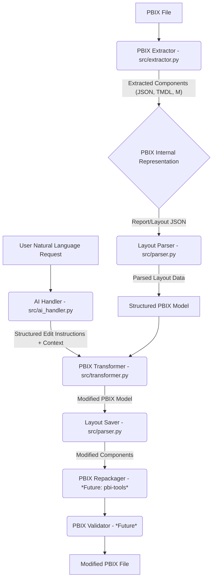

# 🚀 AI-Powered PBIX File Transformer: Revolutionizing Power BI Development

[](https://opensource.org/licenses/MIT)
[](CONTRIBUTING.md)
[](https://github.com/dynamo14324/ai-pbix-transformer/stargazers)
[](https://github.com/dynamo14324/ai-pbix-transformer/network/members)
[](https://github.com/dynamo14324/ai-pbix-transformer/issues)
[](https://github.com/dynamo14324/ai-pbix-transformer/pulls)

## 💡 Project Overview: Bridging AI and Business Intelligence

In the rapidly evolving landscape of data analytics, Power BI stands as a cornerstone for business intelligence. However, the manual manipulation of Power BI Desktop files (`.pbix`) can be a tedious, error-prone, and time-consuming process, especially for complex reports. The **AI-Powered PBIX File Transformer** project emerges as a groundbreaking solution to this challenge, leveraging the power of Artificial Intelligence to automate and streamline the analysis, modification, and repackaging of PBIX files.

This innovative system is designed to act as an intelligent intermediary, allowing users to interact with their Power BI reports using natural language. Imagine instructing an AI to "add a new sales trend chart to the dashboard" or "update the data source credentials across all reports" – this project aims to make such interactions a reality. By deconstructing PBIX files into their fundamental components, applying AI-driven transformations, and then meticulously reassembling them, we unlock unprecedented levels of efficiency and flexibility in Power BI development.

### The Challenge: Manual PBIX Manipulation

Power BI PBIX files are essentially sophisticated archives containing a myriad of elements: data models (expressed in Tabular Model Definition Language - TMDL), intricate report layouts (defined in JSON), data source queries (written in M scripts), and various static resources. Manually navigating and editing these components requires deep technical expertise and is highly susceptible to human error. Even a minor change can inadvertently corrupt the entire file, leading to significant rework and delays.

### Our Solution: AI-Driven Automation

Our project addresses these pain points by introducing an intelligent, automated workflow. Inspired by how AI tools effortlessly handle complex operations on Office files, the AI-Powered PBIX File Transformer provides a programmatic approach to PBIX manipulation. The core process involves several meticulously designed stages:

1.  **Extraction:** Deconstructing the PBIX file into its constituent parts, making them accessible for programmatic interaction.
2.  **Parsing:** Intelligently interpreting the structure and content of critical components, such as the report layout JSON and M-query scripts.
3.  **AI Interpretation:** Utilizing advanced Large Language Models (LLMs) to comprehend natural language instructions from users and translate them into precise, structured edit commands.
4.  **Transformation:** Programmatically applying the AI-generated instructions to modify the extracted PBIX components.
5.  **Repackaging:** Recompiling the modified components back into a valid and functional PBIX file.
6.  **Validation:** Ensuring the integrity and correctness of the transformed PBIX file, guaranteeing that all changes have been applied as intended and without introducing errors.

This end-to-end automation not only accelerates development cycles but also democratizes access to advanced Power BI functionalities, allowing users to focus on insights rather than intricate technical details.

## ✨ Key Features

*   **Automated PBIX Content Extraction:** Seamlessly unpacks PBIX files into a temporary, organized directory structure, exposing all internal components.
*   **Intelligent Report Layout Parsing:** Accurately parses the `Report/Layout` JSON file, enabling granular control over visual elements, pages, and interactions.
*   **Natural Language Command Interface:** Empowers users to issue complex modification requests using intuitive, human-like language via a command-line interface.
*   **Advanced AI-Powered Instruction Generation:** Integrates with cutting-edge AI models to convert natural language requests and contextual report information into actionable, structured edit instructions.
*   **Programmatic PBIX Model Editing:** Applies the AI-generated instructions to the parsed PBIX components, allowing for dynamic adjustments to reports, data models, and queries.
*   **Robust Repackaging (Future Integration):** Future plans include seamless integration with tools like `pbi-tools` to reliably recompile modified components into a valid PBIX file.
*   **Comprehensive Workflow Orchestration:** The `src/transformer.py` script meticulously manages the entire lifecycle, from initial extraction to the final (simulated) repackaging, ensuring a smooth and efficient process.

## 🗺️ Project Roadmap & Architecture

Our development journey is structured into distinct phases, each building upon the last to deliver a robust and feature-rich solution.

### Current Progress

*   **Phase 1: Foundation & Research (Completed)** - Established core understanding of PBIX structure and identified key technologies.
*   **Phase 2: Parsing & Data Modeling (Partially Complete - Layout Parsing)** - Implemented robust parsing for report layouts; ongoing work on data model (TMDL) and M-query parsing.
*   **Phase 3: AI Understanding & Intent Mapping (Initial Implementation)** - Developed initial AI integration for basic natural language understanding and instruction generation.
*   **Phase 4: AI-Driven Edit Engine (Placeholder Implemented)** - Core logic for applying AI instructions to parsed data is in place, with ongoing expansion of editable properties.
*   **Phase 6: User Interface (MVP - CLI Implemented)** - A functional command-line interface allows for initial interaction and testing.

### Future Work

*   **Phase 5: Repackaging & Validation:** Full integration with `pbi-tools` or similar for reliable PBIX re-compilation and automated validation of modified files.
*   **Phase 7: Scaling & Learning:** Enhancing AI models for more complex transformations, improving performance, and incorporating feedback loops for continuous learning.
*   **Graphical User Interface (GUI):** Development of an intuitive web-based or desktop GUI for a more user-friendly experience.
*   **Advanced Data Model Manipulation:** AI-driven modifications to data tables, relationships, and DAX measures.
*   **M-Query Script Generation/Modification:** AI-assisted generation and editing of Power Query M scripts.

### High-Level Architecture

The system's architecture is designed for modularity and scalability, ensuring that each component can be developed and improved independently.



## 🚀 Getting Started: Your First AI-Powered Transformation

Follow these steps to set up the project and run your first AI-driven PBIX transformation.

### Prerequisites

Before you begin, ensure you have the following installed:

*   **Python 3.8+:** Download and install from [python.org](https://www.python.org/downloads/).
*   **Git:** For cloning the repository. Download from [git-scm.com](https://git-scm.com/downloads).
*   **(Optional, but Recommended) `pbi-tools`:** While not strictly required for the current placeholder functionality, `pbi-tools` is essential for actual PBIX repackaging in future phases. Install it by following the instructions on the [pbi-tools GitHub page](https://github.com/pbi-tools/pbi-tools).
*   **(Future) AI Model API Key:** For full AI functionality, you will need access to an AI model API (e.g., OpenAI, Google Gemini API). Configuration details for API keys will be provided within `src/ai_handler.py` as AI integration matures.

### Installation Guide

1.  **Clone the Repository:**
    Open your terminal or command prompt and execute the following command to clone the project to your local machine:
    ```bash
    git clone https://github.com/dynamo14324/ai-pbix-transformer.git
    cd ai-pbix-transformer
    ```

2.  **Create and Activate a Virtual Environment:**
    It is highly recommended to use a virtual environment to manage project dependencies and avoid conflicts with your system's Python packages. Run the following commands:
    ```bash
    python -m venv venv
    # On macOS/Linux:
    source venv/bin/activate
    # On Windows:
    venv\Scripts\activate
    ```

3.  **Install Dependencies:**
    Navigate to the `ai-pbix-transformer` directory (if you're not already there) and install the required Python packages. First, let's create a `requirements.txt` file based on the current `src` directory contents.

    *Initial `requirements.txt` generation (if not present):*
    ```bash
    pip freeze > requirements.txt
    # Or manually create requirements.txt with:
    # pandas
    # openpyxl # if dealing with Excel files in PBIX
    # python-dotenv # for API key management
    # openai # if using OpenAI API
    # google-generativeai # if using Google Gemini API
    ```
    *Then install:*
    ```bash
    pip install -r requirements.txt
    ```
    *(Note: The `requirements.txt` will be updated as more dependencies are added for full AI and repackaging functionality.)*

## 💡 Usage Examples: Transforming Power BI with Natural Language

The primary interface for interacting with the AI-Powered PBIX File Transformer is the `src/transformer.py` script. This script orchestrates the entire process, taking your input PBIX file, desired output location, and natural language edit request.

### Basic Usage Command

```bash
python src/transformer.py \
    --input /path/to/your/report.pbix \
    --output /path/to/your/modified_report.pbix \
    --request "Add a text box with the title 'Confidential Draft' to the top-left corner of the 'Sales Overview' page, and change its font size to 14pt and color to red."
```

### Command Breakdown

*   `python src/transformer.py`: Invokes the main transformation script.
*   `--input /path/to/your/report.pbix`: Specifies the absolute path to the original Power BI PBIX file you wish to modify.
*   `--output /path/to/your/modified_report.pbix`: Defines the absolute path where the transformed PBIX file will be saved. (Currently, this is a simulated output; the actual modified layout is in the temporary directory).
*   `--request "Your natural language instruction here"`: This is where you provide your natural language command to the AI. Be as specific as possible to achieve the desired outcome.

### Understanding the Workflow (Current Implementation)

1.  **Extraction:** The script first extracts the contents of your specified PBIX file into a unique temporary directory (e.g., `./temp_pbix_work/your_report_name_PID/`).
2.  **Parsing:** It then parses the `Report/Layout` JSON file, converting its complex structure into an accessible data model.
3.  **AI Interaction:** Your natural language `--request` is sent to the `src/ai_handler.py`. This module (currently a placeholder with basic logic) simulates interaction with an external AI model. In a fully realized version, the AI would analyze your request in the context of the parsed report structure and generate precise, structured instructions (e.g., `{'action': 'add_visual', 'target': {'page_name': 'Sales Overview', 'position': 'top-left'}, 'parameters': {'visual_type': 'textbox', 'text': 'Confidential Draft', 'font_size': '14pt', 'color': 'red'}}`).
4.  **Edit Application:** The `apply_edits` function within `src/transformer.py` receives these structured instructions. For the current placeholder implementation, it demonstrates how these instructions *would* be applied by adding comments (e.g., `_ai_instruction_add_textbox_on_SalesOverview_page`) directly into the parsed layout data.
5.  **Saving Modified Layout:** The updated layout data (with placeholder comments) is saved back to the temporary directory.
6.  **Simulated Repackaging:** **Important Note:** The actual repackaging of the modified components back into a functional PBIX file is a **future implementation step**. Currently, the script copies the *original* input PBIX file to the `--output` path. The real value of the transformation lies in the modified layout JSON within the temporary directory, which you can inspect.

### How to Inspect Changes

To see the results of the AI's (simulated) modifications, follow these steps after running the `transformer.py` script:

1.  **Locate the Temporary Directory:** Navigate to the `./temp_pbix_work/` directory in your project root.
2.  **Find Your Run:** Inside, you'll find a subdirectory named after your PBIX file and the process ID (e.g., `your_report_name_12345/`).
3.  **Access the Report Layout:** Go into this subdirectory, then navigate to the `Report/` folder. Open the `Layout` file (it's a JSON file) using a text editor.
4.  **Review AI Instructions:** You will observe comments or placeholder entries added by the `apply_edits` function, indicating where the AI would have made the requested changes. This allows you to verify the AI's interpretation and the system's ability to target specific elements.

## 🤝 Contributing to the Project

We welcome and encourage contributions from the community! Whether you're a Power BI expert, an AI enthusiast, a Python developer, or a documentation guru, your input is invaluable. Please refer to our comprehensive [CONTRIBUTING.md](CONTRIBUTING.md) guide for detailed instructions on how to:

*   Report bugs and suggest features.
*   Set up your development environment.
*   Submit pull requests.
*   Adhere to our coding standards.

## 📄 License

This project is open-source and distributed under the **MIT License**. See the [LICENSE](LICENSE) file in the repository for full details.

## 🙏 Acknowledgements

We extend our gratitude to the following projects and communities that have inspired and supported the development of the AI-Powered PBIX File Transformer:

*   The **`pbi-tools`** project for its pioneering work in Power BI file manipulation, serving as a significant inspiration for our repackaging efforts.
*   The vibrant **Power BI Community** for their continuous innovation and valuable resources.
*   The **OpenAI** and **Google AI** teams for their advancements in Large Language Models, which are central to the AI capabilities of this project.

Your support and contributions drive the future of this project!

