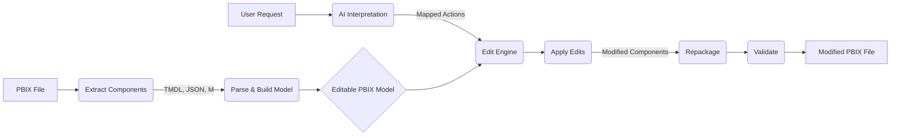

# AI-Powered PBIX File Transformer

[](https://opensource.org/licenses/MIT)
[](CONTRIBUTING.md)
[](https://github.com/dynamo14324/ai-pbix-transformer/stargazers)
[](https://github.com/dynamo14324/ai-pbix-transformer/network/members)

**Transform your Power BI PBIX files using the power of AI!** This project provides a system to programmatically analyze, modify, and repackage PBIX files based on natural language instructions, similar to how AI tools interact with documents like Excel or Word.

## Overview

Power BI Desktop files (PBIX) are essentially zip archives containing various components like data models (TMDL), report layouts (JSON), data source queries (M scripts), and static resources. Manually editing these components is complex and error-prone. This tool aims to automate the process by:

1.  **Extracting:** Deconstructing PBIX files into their core components.
2.  **Parsing:** Understanding the structure and content of these components.
3.  **Modeling:** Creating an editable, structured representation of the PBIX internals.
4.  **AI Interpretation:** Using Large Language Models (LLMs) like GPT-4 to understand user requests (e.g., "Add a sales trend visual," "Update the database connection").
5.  **Editing:** Programmatically applying the requested changes to the PBIX model.
6.  **Repackaging:** Recompiling the modified components back into a valid PBIX file.
7.  **Validating:** Ensuring the modified PBIX file works correctly.

## Features (Planned)

*   **Automated PBIX Extraction & Repackaging:** Leverages `pbi-tools` for reliable PBIX manipulation.
*   **Structured PBIX Model:** Represents PBIX components (TMDL, Layout JSON, M Scripts) in an easily editable format.
*   **Natural Language Interface:** Allows users to specify modifications using plain English.
*   **AI-Powered Edits:** Integrates with LLMs to generate necessary code (DAX, M, JSON) for modifications.
*   **Extensible Edit Engine:** Supports a growing range of modifications, from simple measure changes to complex visual additions.
*   **Validation:** Includes steps to verify the integrity of the modified PBIX file.

## Project Roadmap

This project follows a phased approach to deliver an AI-driven PBIX transformation tool.

**Phase 1: Foundation & Research (Completed)**
*   **Goal:** Understand PBIX internals, collect samples, set up toolchain.
*   **Actions:** Explored PBIX structure using `pbi-tools`, documented component anatomy (TMDL, JSON, M).
*   **Output:** PBIX anatomy guide, initial understanding.

**Phase 2: Parsing & Data Modeling**
*   **Goal:** Automate extraction and create a unified, editable PBIX representation.
*   **Actions:** Develop script for batch extraction, design Python/JSON schema for PBIX model.
*   **Output:** Automated extractor script, PBIX Model definition.

**Phase 3: AI Understanding & Intent Mapping**
*   **Goal:** Enable AI to map user requests to PBIX structure changes.
*   **Actions:** Craft prompt templates for LLMs, build intent-to-action mapping logic.
*   **Output:** Prompt library, mapping functions/rules engine.

**Phase 4: AI-Driven Edit Engine**
*   **Goal:** Programmatically apply changes to extracted PBIX components.
*   **Actions:** Write functions for editing TMDL, JSON, M scripts; integrate LLM for code generation (DAX, M, JSON).
*   **Output:** Edit function library, AI code generator module.

**Phase 5: Repackaging & Validation**
*   **Goal:** Rebuild the PBIX file and ensure it works.
*   **Actions:** Use `pbi-tools` for compilation, implement automated/manual testing procedures.
*   **Output:** End-to-end workflow for modifying and validating PBIX files.

**Phase 6: User Interface (MVP)**
*   **Goal:** Provide a basic user interface.
*   **Actions:** Build a Command-Line Interface (CLI) for user interaction.
*   **Output:** Usable CLI tool.

**Phase 7: Scaling & Learning**
*   **Goal:** Improve AI accuracy and expand capabilities.
*   **Actions:** Implement feedback loop for fine-tuning, add support for more complex edits.
*   **Output:** Enhanced tool performance and feature set.

*(Visual: High-level architecture diagram showing PBIX -> Extract -> Model -> AI -> Edit -> Repackage -> Validate flow - Placeholder)*


## Getting Started

**(Instructions will be added once the core functionality is developed)**

Prerequisites:
*   Python 3.x
*   `pbi-tools` (Installation guide: [https://pbi.tools/](https://pbi.tools/))
*   (Potentially) OpenAI API Key or access to another LLM

Installation:
```bash
git clone https://github.com/dynamo14324/ai-pbix-transformer.git
cd ai-pbix-transformer
pip install -r requirements.txt # (requirements.txt to be added)
```

## Usage

**(Examples will be provided as features become available)**

Example (Conceptual CLI):
```bash
python transform_pbix.py --input report.pbix --output modified_report.pbix --request "Add a new measure 'Total Profit' as SUM(Sales[Revenue]) - SUM(Sales[Cost])"
```

## Contributing

Contributions are welcome! Please read our [CONTRIBUTING.md](CONTRIBUTING.md) (to be created) for guidelines on how to contribute to this project.

## License

This project is licensed under the MIT License - see the [LICENSE](LICENSE) file (to be created) for details.

## Acknowledgements

*   The `pbi-tools` project for enabling programmatic PBIX manipulation.
*   The Power BI community for resources and inspiration.

