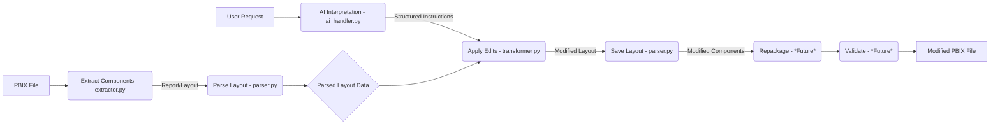

'''
# AI-Powered PBIX File Transformer

[](https://opensource.org/licenses/MIT)
[](CONTRIBUTING.md)
[](https://github.com/dynamo14324/ai-pbix-transformer/stargazers)
[](https://github.com/dynamo14324/ai-pbix-transformer/network/members)

**Transform your Power BI PBIX files using the power of AI!** This project provides a system to programmatically analyze, modify, and repackage PBIX files based on natural language instructions.

## Overview

Power BI Desktop files (PBIX) are essentially zip archives containing various components like data models (TMDL), report layouts (JSON), data source queries (M scripts), and static resources. Manually editing these components is complex and error-prone. This tool aims to automate the process by:

1.  **Extracting:** Deconstructing PBIX files into their core components (`src/extractor.py`).
2.  **Parsing:** Understanding the structure and content of key components like the report layout (`src/parser.py`).
3.  **Modeling:** Creating an editable, structured representation of the PBIX internals (Implicit in parsing/editing).
4.  **AI Interpretation:** Using Large Language Models (LLMs) to understand user requests and translate them into structured edit instructions (`src/ai_handler.py`).
5.  **Editing:** Programmatically applying the requested changes to the PBIX model (Placeholder logic in `src/transformer.py`).
6.  **Repackaging:** Recompiling the modified components back into a valid PBIX file (Future step, requires `pbi-tools` or similar).
7.  **Validating:** Ensuring the modified PBIX file works correctly (Future step).

## Features

*   **Automated PBIX Extraction:** Extracts PBIX contents into a temporary directory.
*   **Report Layout Parsing:** Parses the `Report/Layout` JSON file.
*   **Natural Language Interface:** Accepts user edit requests via command-line argument.
*   **AI-Powered Edit Instruction Generation:** Integrates with an AI model (placeholder) to generate structured edit instructions based on the user request and report structure.
*   **Placeholder Edit Application:** Demonstrates how AI instructions *could* be applied to the parsed layout data (currently adds comments).
*   **End-to-End Workflow Orchestration:** The `src/transformer.py` script manages the process from extraction to simulated repackaging.

## Project Roadmap

This project follows a phased approach:

*   **Phase 1: Foundation & Research (Completed)**
*   **Phase 2: Parsing & Data Modeling (Partially Complete - Layout Parsing)**
*   **Phase 3: AI Understanding & Intent Mapping (Initial Implementation)**
*   **Phase 4: AI-Driven Edit Engine (Placeholder Implemented)**
*   **Phase 5: Repackaging & Validation (Future Work)**
*   **Phase 6: User Interface (MVP - CLI Implemented)**
*   **Phase 7: Scaling & Learning (Future Work)**

*(Visual: High-level architecture diagram)*


## Getting Started

### Prerequisites

*   Python 3.8+
*   Required Python packages (will be listed in `requirements.txt`)
*   **(Future)** `pbi-tools` for actual repackaging.
*   **(Future)** Access to an AI model API (e.g., OpenAI) and an API key configured for `src/ai_handler.py`.

### Installation

1.  Clone the repository:
    ```bash
    git clone https://github.com/dynamo14324/ai-pbix-transformer.git
    cd ai-pbix-transformer
    ```
2.  Create a virtual environment (recommended):
    ```bash
    python -m venv venv
    source venv/bin/activate  # On Windows use `venv\Scripts\activate`
    ```
3.  Install dependencies (once `requirements.txt` is created):
    ```bash
    pip install -r requirements.txt
    ```

## Usage

The main entry point is `src/transformer.py`. It takes the input PBIX file, the desired output path, and the natural language edit request.

**Example Command:**

```bash
python src/transformer.py \
    --input /path/to/your/report.pbix \
    --output /path/to/your/modified_report.pbix \
    --request "Add a textbox with the text 'Confidential Draft' to the main page"
```

**Explanation:**

1.  The script extracts `/path/to/your/report.pbix` into a temporary directory (`./temp_pbix_work/...`).
2.  It parses the `Report/Layout` file.
3.  It sends the user request (`"Add a textbox..."`) and a summary of the report structure to the AI handler (`src/ai_handler.py`).
4.  The AI handler (currently a placeholder) returns structured instructions (e.g., `{'action': 'add_visual', 'target': {'section_name': 'ReportSection'}, 'parameters': {'visual_type': 'textbox', 'properties': {'text': 'Confidential Draft'}}}`).
5.  The `apply_edits` function in `transformer.py` receives these instructions and modifies the parsed layout data (currently by adding comments like `_ai_instruction_add_textbox_on_ReportSection`).
6.  The modified layout data is saved back to the temporary directory.
7.  **Important:** Repackaging is **not yet implemented**. The script currently simulates this by copying the *original* input PBIX to the output path. The actual modified layout JSON remains in the temporary directory for inspection.

**To Inspect Changes:**

*   After running the command, look inside the `./temp_pbix_work/` directory.
*   Find the subdirectory corresponding to your run (it includes the PBIX filename and process ID).
*   Navigate to the `Report` folder within that subdirectory.
*   Open the `Layout` file (it's JSON) to see the comments added by the placeholder `apply_edits` function, indicating where the AI intended to make changes.

## Contributing

Contributions are welcome! Please read our [CONTRIBUTING.md](CONTRIBUTING.md) for guidelines on how to contribute to this project.

## License

This project is licensed under the MIT License - see the [LICENSE](LICENSE) file for details.

## Acknowledgements

*   The `pbi-tools` project for inspiration and potential future integration.
*   The Power BI community for resources.
'''
